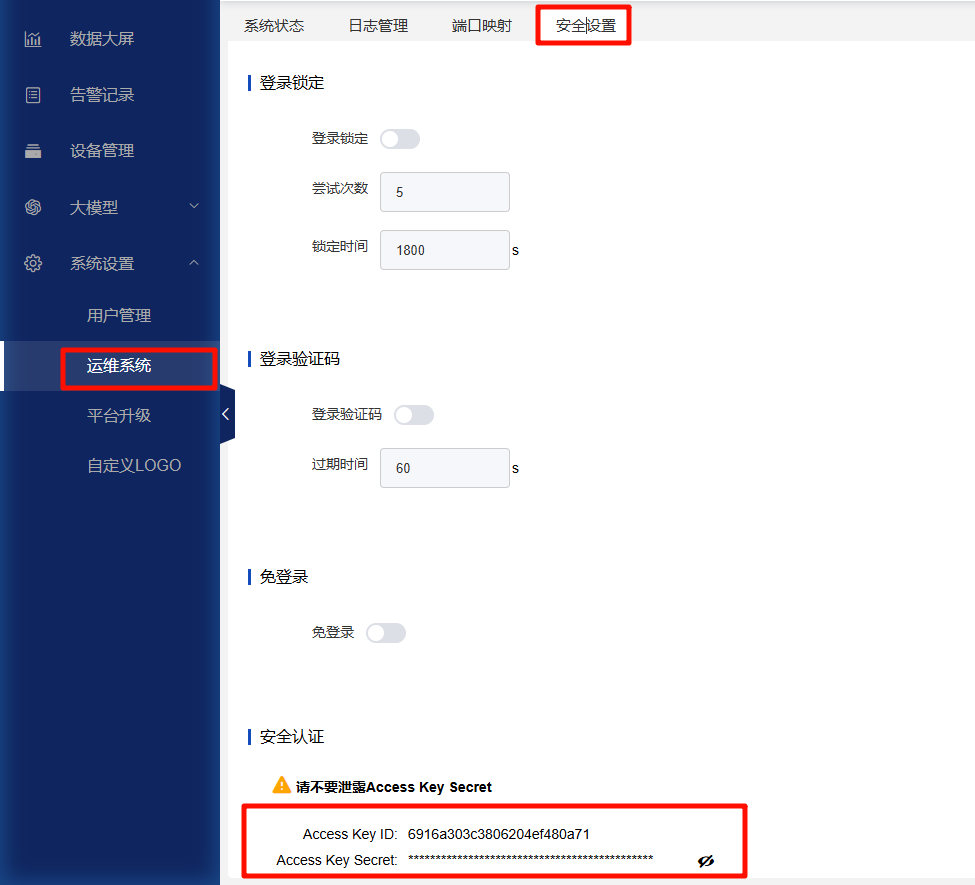

# Cloud-based Host Platform
# Example Code for Host Video Stream Playback and Real-Time Boxes

1. Download the sample code to your local machine (Windows is fine).  
2. Edit the `serverIp`, `accessKey`, and `accessSecret` fields in `index.html`.

- Modify the three fields as shown in the image below:

  

- You can find `accessKey` and `accessSecret` after logging into the platform, as shown below:

  

3. Double-click `index.html` to open and start using the sample code.
